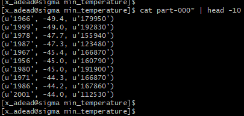
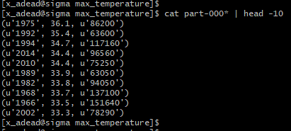
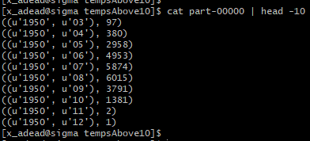
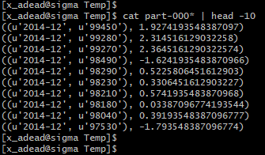
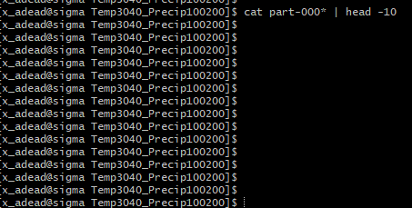
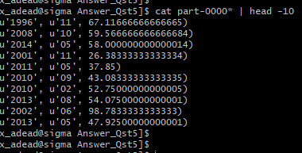

```{r setup, include=FALSE}
knitr::opts_chunk$set(echo = TRUE)
```


# Question 1

**Min Temperature**

```{r, eval=FALSE,echo=TRUE}
from pyspark import SparkContext
sc = SparkContext(appName = "exercise 1")
# This path is to the file on hdfs
temperature_file = sc.textFile("BDA/input/temperature-readings.csv")
lines = temperature_file.map(lambda line: line.split(";"))

#Maps
# (key, value) = (year,temperature)
year_temperature = lines.map(lambda x: (x[1][0:4],(float(x[3]),x[0])))

#filters
year_temperature = year_temperature.filter(lambda x: int(x[0]) >= 1950 and int(x[0])<= 2014)

#Transformations
min_temperatures = year_temperature.reduceByKey(lambda x,y :x if x<=y else y)
min_temperatures1 = min_temperatures.sortBy(ascending = True, keyfunc=lambda k: k[1][0])
min_temperatures2 = min_temperatures1.map(lambda x: (x[0], float(x[1][0]),x[1][1]))

#Actions
# Following code will save the result into /user/ACCOUNT_NAME/BDA/output folder
min_temperatures2.saveAsTextFile("BDA/output/min_temperature")

```

```{r,echo=FALSE, fig.align='center'}

```

**Max Temperature**
```{r, echo=TRUE, eval=FALSE}
from pyspark import SparkContext
sc = SparkContext(appName = "exercise 1")
# This path is to the file on hdfs
temperature_file = sc.textFile("BDA/input/temperature-readings.csv")
lines = temperature_file.map(lambda line: line.split(";"))

#Maps
# (key, value) = (year,temperature)
year_temperature = lines.map(lambda x: (x[1][0:4],(float(x[3]),x[0])))

#filters
year_temperature = year_temperature.filter(lambda x: int(x[0]) >= 1950 and int(x[0])<= 2014)

#Transformations
max_temperatures = year_temperature.reduceByKey(lambda x,y :x if x>=y else y)
max_temperatures1 = max_temperatures.sortBy(ascending = False, keyfunc=lambda k: k[1][0])
max_temperatures2 = max_temperatures1.map(lambda x: (x[0], float(x[1][0]),x[1][1]))

#Actions
# Following code will save the result into /user/ACCOUNT_NAME/BDA/output folder
max_temperatures2.saveAsTextFile("BDA/output/max_temperature")
```

```{r,echo=FALSE, fig.align='center'}

```

# Question 2

```{r,echo=TRUE, eval=FALSE}
from pyspark import SparkContext
sc = SparkContext(appName = "exercise 1")
# This path is to the file on hdfs
temperature_file = sc.textFile("BDA/input/temperature-readings.csv")
lines = temperature_file.map(lambda line: line.split(";"))

# (key, value) = (year,temperature)
year_temLess10 = lines.map(lambda x: ((x[1][0:4], x[1][5:7]),float(x[3])))

#filters
year_temLess10 = year_temLess10.filter(lambda x: int(x[0][0]) >= 1950 and int(x[0][0]) <= 2014)
tempsAbove10 = year_temLess10.filter(lambda x: x[1] >= 10)

#Transformations
tempsAbove10counts = tempsAbove10.map(lambda x:((x[0][0], x[0][1]),1))
tempsAbove10 = tempsAbove10counts.reduceByKey(lambda x,y : x+y).sortByKey()

#Actions
# Following code will save the result into /user/ACCOUNT_NAME/BDA/output folder
tempsAbove10.saveAsTextFile("BDA/output/tempsAbove10")

```

```{r,echo=FALSE, fig.align='center'}

```

**Distinct Temp above 10 degrees per station**

```{r,echo=TRUE, eval=FALSE}
from pyspark import SparkContext
sc = SparkContext(appName = "exercise 1")
#This path is to the file on hdfs
temperature_file = sc.textFile("BDA/input/temperature-readings.csv")
lines = temperature_file.map(lambda line: line.split(";"))

#Maps
#(key, value) = (year,temperature)
year_temLess10Distinct = lines.map(lambda x: (x[1][0:7], (x[0], float(x[3]))))

#filters
year_temLess10Distinct = year_temLess10Distinct.filter(lambda x: int(x[0][0:4])>=1950 and int(x[0][0:4])<=2014)
year_temLess10Distinct = year_temLess10Distinct.filter(lambda x: float(x[1][1]) >= 10)

#Transformations
month = year_temLess10Distinct.map(lambda x: (x[0],x[1][0])).distinct()
month_unique = month.map(lambda x: x[0])
month_count = month_unique.map(lambda s : (s, 1))
count = month_count.reduceByKey(lambda a,b : a + b)                       


#Actions
#Following code will save the result into /user/ACCOUNT_NAME/BDA/output folder
count.saveAsTextFile("BDA/output/DistictTempAbove10")

```

# Question 3

```{r,echo=TRUE, eval=FALSE}
from pyspark import SparkContext
sc = SparkContext(appName = "exercise 1")
#This path is to the file on hdfs
temperature_file = sc.textFile("BDA/input/temperature-readings.csv")
lines = temperature_file.map(lambda line: line.split(";"))

#(key, value) = (year,temperature)
rdd = lines.map(lambda x: ((x[1][0:11],x[0]),float(x[3])))

#filters
average = rdd.filter(lambda x: int(x[0][0][0:4]) >= 1960 and int(x[0][0][0:4]) <= 2014)

max_temperatures = average.reduceByKey(lambda x,y :x if x>=y else y)
min_temperatures = average.reduceByKey(lambda x,y :x if x<=y else y)

temperature_average = max_temperatures.join(min_temperatures)

rdd = temperature_average.map(lambda x: (x[0], x[1][0] + x[1][1]))

daily_temp_rdd = rdd.map(lambda x: (x[0],x[1]/2))

monthly_temp_rdd = daily_temp_rdd.map(lambda x: ((x[0][0][0:7],x[0][1]),x[1]))
.mapValues(lambda x: (x, 1)).reduceByKey(lambda x, y: (x[0]+y[0], x[1]+y[1]))
.mapValues(lambda x: x[0]/x[1]).sortByKey(ascending=False)

monthly_temp_rdd.saveAsTextFile("BDA/output/Temp")

```


```{r, echo=FALSE, fig.align='center'}

```

# Question 4

```{r,echo=TRUE, eval=FALSE}
from pyspark import SparkContext
sc = SparkContext(appName = "exercise 1")
# This path is to the file on hdfs

temp_data = sc.textFile("BDA/input/temperature-readings.csv")
precip_data = sc.textFile("BDA/input/precipitation-readings.csv")

#(key, value) = (year,temperature)
lines_temp = temp_data.map(lambda lines: lines.split(";"))
lines_precip = precip_data.map(lambda lines: lines.split(";"))

#filter
temp = lines_temp.map(lambda x: (int(x[0]), float(x[3])))
temp_max_station = temp.reduceByKey(lambda a,b: a if a >= b else b)
temp_max_station_boundary = temp_max_station.filter(lambda x: x[1] >= 25 and x[1] <= 30)

precip = lines_precip.map(lambda x: ((int(x[0]), x[1][0:4], x[1][5:7], x[1][8:10]), float(x[3])))
daily_precip = precip.reduceByKey(lambda a,b: a + b)
daily_precip = daily_precip.map(lambda x: (x[0][0], x[1]))
precip_max_station = daily_precip.reduceByKey(lambda a,b: a if a >= b else b)
precip_max_station_boundary = precip_max_station.filter(lambda x: x[1] >= 100 and x[1] <= 200)

joins = temp_max_station_boundary.join(precip_max_station_boundary)

# Following code will save the result into /user/ACCOUNT_NAME/BDA/output folder
joins.saveAsTextFile("BDA/output/Temp3040_Precip100200")
#data_precip_max_station_restrictions.saveAsTextFile("BDA/output/A1")
#data_temp_max_station_restrictions.saveAsTextFile("BDA/output/A2")

```


```{r,echo=FALSE, fig.align='center'}

```

# Question 5

```{r,echo=TRUE, eval=FALSE}
from pyspark import SparkContext
sc = SparkContext(appName = "exercise 1")
# This path is to the file on hdfs

station_data = sc.textFile("BDA/input/stations-Ostergotland.csv")
precip_data = sc.textFile("BDA/input/precipitation-readings.csv")

stations = station_data.map(lambda line: line.split(";")[0]).collect()

precip = precip_data.map(lambda line: line.split(";"))

precip_years = precip.filter(lambda x: int(x[1][0:4])>=1993 and int(x[1][0:4])<=2016)
counts = precip_years.filter(lambda x: x[0] in stations)

counts = counts.map(lambda x: ((x[1][0:7], x[0]), float(x[3])))

preci_station = counts.reduceByKey(lambda a,b: a+b)

avg_preci = preci_station.map(lambda x: (x[0][0],  (x[1], 1)))

preci_monthly = avg_preci.reduceByKey(lambda a,b: (a[0]+b[0],a[1]+b[1]))
preci_monthly = preci_monthly.map(lambda x: (x[0][0:4], x[0][5:7], x[1][0]/x[1][1]))

preci_monthly.saveAsTextFile("BDA/output/Answer_Qst5")

```

```{r, echo=FALSE, fig.align='center'}

```

