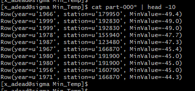
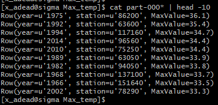
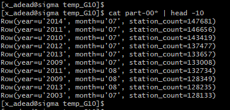
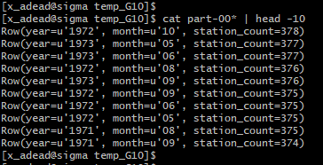
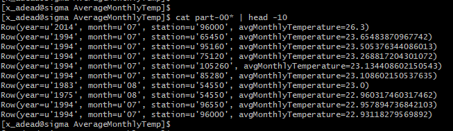
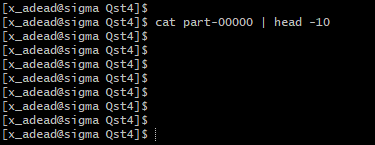
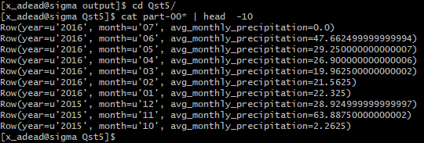

```{r setup, include=FALSE}
knitr::opts_chunk$set(echo = TRUE)
```

# Question 1
```{r,eval=FALSE,echo=TRUE}
from pyspark import SparkContext
from pyspark.sql import SQLContext, Row
from pyspark.sql import functions as F
sc =SparkContext()
sqlContext=SQLContext(sc)

temperature_file = sc.textFile("BDA/input/temperature-readings.csv")
parts = temperature_file.map(lambda l:l.split(";"))

tempReadings = parts.map(lambda p: Row(station=p[0],  date=p[1], year=p[1].split("-")[0],
time=p[2],  Temp=float(p[3]), quality=p[4]))

TableReadings = sqlContext.createDataFrame(tempReadings)
TableReadings.registerTempTable("tempReadings")

maximum_temperature = TableReadings.select(["year","station","Temp"])
.filter((TableReadings['year'] <=2014)& (TableReadings["year"]>=1950))
.groupby(['year','station']).agg(F.max('Temp')).groupby("year")
.agg(F.max("max(Temp)").alias("Temp")).orderBy('Temp',ascending=False)

maximum_temperature1 = maximum_temperature.join(TableReadings,["Temp","year"],"inner")

maximum_temperature2 = maximum_temperature1.select(["year","station","Temp"])
.orderBy("Temp",ascending= False).withColumnRenamed("Temp","MaxValue")

minimum_temperature = TableReadings.select(["year","station","Temp"])
.filter((TableReadings['year'] <=2014)& (TableReadings["year"]>=1950))
.groupby(['year','station']).agg(F.min('Temp')).groupby("year")
.agg(F.min("min(Temp)").alias("Temp")).orderBy('Temp',ascending=True)

minimum_temperature1 = minimum_temperature.join(TableReadings,["Temp","year"],"inner")

minimum_temperature2 = minimum_temperature1.select(["year","station","Temp"])
.orderBy("Temp",ascending= True).withColumnRenamed("Temp","MinValue")

maximum_temperature2_rdd = maximum_temperature2.rdd
minimum_temperature2_rdd = minimum_temperature2.rdd

maximum_temperature2_rdd.saveAsTextFile("BDA/output/Max_temp")
minimum_temperature2_rdd.saveAsTextFile("BDA/output/Min_Temp")
```

```{r,echo=FALSE, fig.align='center'}


```

# Question 2
## Question 2a
```{r,eval=FALSE,echo=TRUE}
from pyspark import SparkContext
from pyspark.sql import SQLContext, Row
from pyspark.sql import functions as F
sc =SparkContext(appName = "exercise 1")
sqlContext=SQLContext(sc)

temperature_file = sc.textFile("BDA/input/temperature-readings.csv")
parts = temperature_file.map(lambda l:l.split(";"))

tempReadings = parts.map(lambda p: Row(station=p[0],date=p[1],year=p[1].split("-")[0]
                                       ,month=p[1].split("-")[1],time=p[2],
                                       Temp=float(p[3]),quality=p[4]))

TableReadings = sqlContext.createDataFrame(tempReadings)
TableReadings.registerTempTable("tempReadings")

TempAbove10 = TableReadings.select(["year","month","station"])
.filter((TableReadings['year'] <=2014) & (TableReadings["year"]>=1950)
& (TableReadings["Temp"] > 10)).groupby(["year","month"])
.agg(F.count("station").alias("station_count")).orderBy("station_count",ascending=False)

TempAbove10.show()

TempAbove10.rdd.saveAsTextFile("BDA/output/temp_G10")
```

```{r,echo=FALSE, fig.align='center'}

```

## Question 2B
```{r,eval=FALSE,echo=TRUE}
from pyspark import SparkContext
from pyspark.sql import SQLContext, Row
from pyspark.sql import functions as F
sc =SparkContext(appName = "exercise 1")
sqlContext=SQLContext(sc)

temperature_file = sc.textFile("BDA/input/temperature-readings.csv")
parts = temperature_file.map(lambda l:l.split(";"))

tempReadings = parts.map(lambda p: Row(station=p[0],date=p[1],year=p[1]
                                       .split("-")[0],month=p[1].split("-")[1],
                                       time=p[2],  Temp=float(p[3]),quality=p[4]))

TableReadings = sqlContext.createDataFrame(tempReadings)
TableReadings.registerTempTable("tempReadings")

TempAbove10Distinct = TableReadings.select(["year","month","station"])
.filter((TableReadings['year'] <=2014) & (TableReadings["year"]>=1950)
& (TableReadings["Temp"] > 10)).groupby(["year","month"])
.agg(F.countDistinct("station").alias("station_count"))                                           
.orderBy("station_count",ascending=False)

TempAbove10Distinct.rdd.saveAsTextFile("BDA/output/TempAbove10Distinct")
```

```{r,echo=FALSE, fig.align='center'}

```

# Question 3
```{r,eval=FALSE,echo=TRUE}
from pyspark import SparkContext
from pyspark.sql import SQLContext, Row
from pyspark.sql import functions as F
sc =SparkContext(appName = "exercise 1")
sqlContext=SQLContext(sc)

temperature_file = sc.textFile("BDA/input/temperature-readings.csv")
parts = temperature_file.map(lambda l:l.split(";"))

tempReadings = parts.map(lambda p: Row(station=p[0],date=p[1],year=p[1].split("-")[0],
                                       month=p[1].split("-")[1],day=p[1].split("-")[2],time=p[2],
                                       Temp=float(p[3]),quality=p[4]))
TableReadings = sqlContext.createDataFrame(tempReadings)
TableReadings.registerTempTable("tempReadings")

AverageTempDaily = TableReadings.select(["year","month","day","station","Temp"])
.filter((TableReadings["year"]<=2014) & (TableReadings["year"]>=1960))
.groupby(["year","month","day","station"])
.agg((F.avg('Temp')).alias("daily_avg_temp"))
.orderBy(['year','month','station',"daily_avg_temp"],ascending=False)

AverageTempMonthly= AverageTempDaily.select(["year","month","station","daily_avg_temp"])
.groupBy(["year","month","station"]).agg((F.avg('daily_avg_temp')).alias("avgMonthlyTemperature"))
.orderBy("avgMonthlyTemperature",ascending=False)

AverageTempMonthly_rdd = AverageTempMonthly.rdd

AverageTempMonthly.rdd.saveAsTextFile("BDA/output/AverageMonthlyTemp")
```

```{r,echo=FALSE, fig.align='center'}

```

# Question 4
```{r,eval=FALSE,echo=TRUE}
from pyspark import SparkContext
from pyspark.sql import SQLContext, Row
from pyspark.sql import functions as F
sc =SparkContext(appName = "exercise 1")
sqlContext=SQLContext(sc)

temp_data = sc.textFile("BDA/input/temperature-readings.csv")
precip_data = sc.textFile("BDA/input/precipitation-readings.csv")

lines_temp = temp_data.map(lambda lines: lines.split(";"))
lines_precip = precip_data.map(lambda lines: lines.split(";"))

tempReadings = lines_temp.map(lambda p: Row(station=p[0],date=p[1],year=p[1].split("-")[0],
month=p[1].split("-")[1],time=p[2],  Temp=float(p[3]),quality=p[4]))

precipReadings = lines_precip.map(lambda p: Row(station=p[0], date=p[1], year=p[1].split("-")[0],
month=p[1].split("-")[1], day=p[1].split("-")[2], time=p[2], precip=float(p[3]), quality=p[4]))

TableTempReadings = sqlContext.createDataFrame(tempReadings)
TableTempReadings.registerTempTable("tempReadings")

TablePrecipReadings = sqlContext.createDataFrame(precipReadings)
TablePrecipReadings.registerTempTable("precipReadings")

maximum_temperature = TableTempReadings.select(["station","Temp"])
.groupby("station").agg(F.max('Temp').alias("MaxTemp")).orderBy('MaxTemp',ascending=False)
maximum_temperature = maximum_temperature.select(["station","MaxTemp"])
.filter((maximum_temperature["MaxTemp"] >= 25) & (maximum_temperature["MaxTemp"] <= 30))

maximum_precipitation_daily = TablePrecipReadings.select(["station","year","month","day","precip"])
.groupby(["station","year","month","day"])
.agg(F.sum("precip").alias("daily_precip_sum"))
.orderBy("daily_precip_sum",ascending=False)maximum_precipitation =maximum_precipitation_daily
.select(["station","daily_precip_sum"])
.groupby("station").agg(F.max("daily_precip_sum").alias("maxDailyPrecipitation"))
.orderBy("station",ascending=False)


maximum_precipitationFiltered = maximum_precipitation.
filter((maximum_precipitation["maxDailyPrecipitation"] > 100) 
       & (maximum_precipitation["maxDailyPrecipitation"] < 200))

Result = maximum_temperature.join(maximum_precipitationFiltered,"station","inner")
.orderBy("station",ascending=False)

Result.rdd.saveAsTextFile("BDA/output/Qst4")
```

```{r,echo=FALSE, fig.align='center'}

```

# Question 5
```{r,eval=FALSE,echo=TRUE}
from pyspark import SparkContext
from pyspark.sql import SQLContext, Row
from pyspark.sql import functions as F
sc =SparkContext(appName = "exercise 1")
sqlContext=SQLContext(sc)

station_data = sc.textFile("BDA/input/stations-Ostergotland.csv")
precip_data = sc.textFile("BDA/input/precipitation-readings.csv")

stations = station_data.map(lambda line: line.split(";"))

precip = precip_data.map(lambda line: line.split(";"))

precipReadings = precip.map(lambda p: Row(station=p[0], date=p[1], year=p[1].split("-")[0],
month=p[1].split("-")[1], day=p[1].split("-")[2], time=p[2], precip=float(p[3]), quality=p[4]))
TablePrecipReadings = sqlContext.createDataFrame(precipReadings)
TablePrecipReadings.registerTempTable("precipReadings")

stationReadings = stations.map(lambda x: Row(station=x[0], name=x[1]))
TablestationReadings = sqlContext.createDataFrame(stationReadings)
TablestationReadings.registerTempTable("stationReadings")

TablePrecipReadings = TablePrecipReadings.filter((TablePrecipReadings["year"] >= 1992)&
 (TablePrecipReadings["year"] <= 2016))
TablePrecipReadings = TablePrecipReadings.join(TablestationReadings,"station","inner")
TablePrecipReadings = TablePrecipReadings.groupby(["station","year","month"])
.agg(F.sum("precip")).groupby(["year",
"month"]).agg(F.avg("sum(precip)").alias("avg_monthly_precipitation"))
.orderBy(["year","month"],ascending= False)
TablePrecipReadings.rdd.saveAsTextFile("BDA/output/Qst5")
```

```{r,echo=FALSE, fig.align='center'}

```

